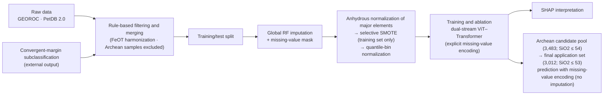

# Basalt Tectonic Setting Discrimination via a Dual-Stream ViT–Transformer

> An end-to-end deep-learning workflow for classifying basalt samples into
> **nine tectonic settings** using 36 major and trace elements. The trained
> model is further applied to Archean basalts to investigate early Earth
> tectonic regimes.
>
> This repository provides reproducible code for the complete workflow, from
> raw-data preprocessing and model training to SHAP interpretation and Archean
> applications.


[](https://doi.org/10.5281/zenodo.20736587)

> **Data access:** The source code is hosted on GitHub, while the datasets are
> archived separately on Zenodo
> ([DOI: 10.5281/zenodo.20736587](https://doi.org/10.5281/zenodo.20736587)).
> The repository does not include the datasets by default. Download and arrange
> them as described in [Section 6: Data Availability](#6-data-availability)
> before running the workflow.

---

## 1. Method Overview

The main model, **GeoDAN**, is a dual-stream architecture that combines a
Vision Transformer (ViT) with a sequence Transformer and explicitly encodes
missing values:

- **Matrix branch (ViT):** The 36 elements are arranged into a 6 × 6 matrix
  with two input channels: quantile-normalized values and the original
  missing-value mask. The matrix is processed by patch embedding and a ViT
  encoder.
- **Sequence branch (Transformer):** The 36 elements are arranged in a fixed
  geochemical sequence. Each element contains two features—the normalized
  value and its missing-value mask—and is processed by linear embedding and a
  Transformer encoder.
- **Fusion:** Mean-pooled features from the two branches are concatenated and
  passed to an MLP classification head for nine-class prediction.
- **Loss and class imbalance:** The model uses standard cross-entropy loss
  without class weights. Class imbalance is handled by selective SMOTE on the
  training set only.

`04_model/ablation_v4_vit_transformer.py` trains and evaluates the full model,
ablation variants, deep-learning baselines, and conventional machine-learning
baselines in a single workflow. These include ViT-only, Transformer-only,
no-positional-encoding, CNN-BiLSTM, CNN-ViT-Transformer, CNN-only, random
forest, SVM, XGBoost, and MLP models. Results from multiple random seeds are
reported as mean ± standard deviation.

The **nine tectonic-setting classes** are `SPREADING_CENTER`, `OCEAN_ISLAND`,
`CONTINENTAL_RIFT`, `OCEANIC_PLATEAU`, `CONTINENTAL_FLOOD_BASALT`,
`BACK-ARC_BASIN`, `Island_arc`, `Continental_arc`, and `Intra-oceanic_arc`.

---

## 2. Workflow Overview



For detailed steps, input/output files, and script mappings, see
[docs/workflow.md](docs/workflow.md).

---

## 3. Repository Structure

```text
basalt_tectonic_discrimination/
├── config/paths.py            # Centralized path configuration used by all scripts
├── data/                      # Data files distributed through Zenodo; see data/README.md
├── 01_preprocessing/          # Filtering, merging, and dataset splitting
│   ├── filter/                # extract_georoc.py and extract_petdb.py: rule-based filtering
│   │                          # iron_normalization.py: FeOT harmonization
│   │                          # Optional interactive filtering and analysis tools
│   ├── combine_list.py
│   └── split_train_test.py
├── 02_imputation/             # Global RF imputation and missing-value-mask generation
├── 03_normalization/          # Anhydrous normalization, selective SMOTE, and quantile normalization
├── 04_model/                  # Model training, ablation studies, baselines, and five-fold CV
├── 05_interpretation/         # SHAP-based model interpretation
├── 06_archean_application/    # Archean prediction, applicability, and consistency analyses
├── 07_figures/                # Manuscript figures
├── tools/geochem_workflow_designer/  # Visual workflow designer using Python and Vue
├── docs/workflow.md           # End-to-end workflow documentation
├── requirements.txt
├── LICENSE
└── .gitignore
```

---

## 4. Environment and Installation

Python 3.10 or later is recommended.

```bash
git clone https://github.com/jiunuan/tectnoic_setting_discrimination.git
cd tectnoic_setting_discrimination

# Create and activate a virtual environment with either conda or venv.
# The project has been verified with the existing babeldoc environment.
conda activate babeldoc

# Install the dependencies
pip install -r requirements.txt
```

> **PyTorch:** The `torch` entry in `requirements.txt` is a placeholder. To
> enable GPU training, use the installation command at
> [pytorch.org](https://pytorch.org) that matches your local CUDA version. A GPU
> is recommended for model training.

> **Windows environment:** Run the workflow with the Python interpreter from the
> activated environment (`where python` should point to `...\envs\babeldoc\python.exe`).
> The system Anaconda base interpreter may fail to load PyTorch DLLs even when
> the package is installed.

Download the datasets from
[Zenodo (DOI: 10.5281/zenodo.20736587)](https://doi.org/10.5281/zenodo.20736587)
and place them under `data/` as described in
[Section 6: Data Availability](#6-data-availability) and
[data/README.md](data/README.md).

---

## 5. Quick Reproduction

The stage-specific scripts do not require command-line arguments. Their
settings are defined at the top of each script and in `config/paths.py`.

```bash
# 1. Modern training/test split from the three Zenodo files
python 01_preprocessing/split_train_test.py

# 2. Global imputation and missing-value masks
# Fit on the training set and transform the test set.
# For Archean data, only the mask is generated; missing values are not imputed.
python 02_imputation/imputation_train_predict.py

# 3. Anhydrous normalization, SMOTE, and quantile normalization
# Quantile boundaries are fitted on the training set before SMOTE.
python 03_normalization/normalize_major_elements.py
python 03_normalization/selective_smote.py
python 03_normalization/normalize.py

# 4. Model training
# A GPU is recommended. Values and missing-value masks are used as two channels.
python 04_model/ablation_v4_vit_transformer.py

# 4.1. Optional five-fold cross-validation
python 04_model/kfold_vit_transformer.py

# 5. SHAP interpretation using the true_class_median aggregation
python 05_interpretation/plot_shap_summary.py
python 05_interpretation/plot_shap_ac_from_saved.py  # Optional: redraw panels a/c from cached results

# 6. Archean prediction from the Zenodo candidate pool
# Requires the trained model and the generated quantile parameters.
# With only the three Zenodo files, prediction-only mode is automatic.
python 06_archean_application/standardize_craton_names.py
python 06_archean_application/archean_vit_transformer_dualstream_predict_analysis.py

# 7. Data-distribution figures
python 07_figures/selected_element_boxplots.py
python 07_figures/distribution_elevation.py  # Optional: requires a world basemap
```

The time-evolution, sensitivity, and six-craton case-study figures require the
additional Liu et al. source table and case-study CSV files under
`data/archean/data/`. Those supplementary files are not part of the minimal
three-file Zenodo release.

The original GEOROC/PetDB filtering commands remain available as optional
historical reconstruction tools:

```bash
python 01_preprocessing/filter/extract_georoc.py
python 01_preprocessing/filter/extract_petdb.py
python 01_preprocessing/combine_list.py
python 06_archean_application/extended_archean_pool_analysis.py
```

They require upstream raw tables that are not included in the Zenodo release.

The imputation script reuses an existing result only when the cached training
and test labels match the current split. Set
`BASALT_REUSE_IMPUTATION_CACHE=0` to force a complete MissForest refit.

By default, `split_train_test.py` uses the published Zenodo modern-basalt table.
To explicitly chain the newly generated GEOROC+PetDB table from steps 1–3,
set `BASALT_USE_COMBINED=1` before running the split script.

The model script keeps the paper configuration (`200` epochs and seeds
`42,123`) by default. For a short installation smoke test, isolate the outputs
and run one epoch:

```bash
GEODAN_EPOCHS=1 GEODAN_SEEDS=42 \
GEODAN_OUTPUT_DIR=data/models/smoke_test \
python 04_model/ablation_v4_vit_transformer.py
```

For a SHAP dependency smoke test, use a separate output directory and a very
small sample:

```bash
SHAP_N_EXPLAIN_PER_CLASS=2 SHAP_CLASS_LIMIT=2 SHAP_N_BACKGROUND=10 \
SHAP_DRAW_BEESWARM=0 SHAP_OUTPUT_DIR=data/models/shap_smoke \
python 05_interpretation/plot_shap_summary.py
```

### Five-Fold Cross-Validation

`04_model/kfold_vit_transformer.py` does not use the fixed 20% holdout test set.
It reads only `data/04_split/01_basalt_number_year_train.csv` and creates five
training and validation folds within that dataset.

For each fold, the script repeats all preprocessing steps required by the main
workflow: global random-forest imputation fitted on the fold's training subset
and applied to its validation subset, recording the original missing-value
mask, anhydrous normalization of major elements, selective SMOTE applied only
to the fold's training data with proportionally scaled target counts, fitting
quantile boundaries on the pre-SMOTE training fold, transforming the validation
fold, and training the model with explicit missing-value encoding. Each fold is
run with random seeds `42` and `123`.

Per-run and summary results are written to:

- `data/models/kfold/kfold_per_run_results.csv`
- `data/models/kfold/kfold_summary.csv`

**Data-leakage prevention:** The training/test split is created during
preprocessing by `split_train_test.py`. All subsequent estimators and
transformations—including global imputation, SMOTE, and quantile-boundary
fitting—are fitted using the training data only. Quantile boundaries are fitted
before SMOTE. The test and Archean datasets are transformed only. Archean
samples are not imputed; missing entries are explicitly represented as
`value = 0` and `mask = 1`.

---

## 6. Data Availability

The code and data are distributed separately: the code is hosted in this
GitHub repository, and the datasets are archived on Zenodo. The repository's
`.gitignore` excludes the contents of `data/`, except for `data/README.md` and
empty directory placeholders. You must therefore download the data before
running the workflow.

- **Data DOI:** [10.5281/zenodo.20736587](https://doi.org/10.5281/zenodo.20736587)

The streamlined Zenodo release, `basalt_geochemistry_dataset`, contains exactly
three tables. Keep the downloaded directory unchanged:

```text
data/basalt_geochemistry_dataset/modern_basalt_geochemistry.csv
data/basalt_geochemistry_dataset/archean_basalt_geochemistry.csv
data/basalt_geochemistry_dataset/archean_basalt_geodan_predictions.csv
```

The scripts read these files directly. Intermediate outputs such as dataset
splits, imputed tables, SMOTE results, and 1–255 encoded tables are regenerated
under `data/04_split/`, `data/05_imputed/`, and `data/06_normalized/`.

Once the three files are present, the modern training workflow can be
reproduced from `split_train_test.py` onward. The published 3,012-row Archean
prediction table is available immediately; generating a new Archean prediction
requires locally trained model weights.

The minimal release does not include the original GEOROC and PetDB tables, the
convergent-margin subclassification output, the original Liu et al. (2024)
source table, the six case-study CSV files, or model weights. Reproducing the
earliest filtering and extended case-study stages therefore requires those
additional upstream inputs. The optional historical preprocessing tools use
**GEOROC** and **PetDB** data, while convergent-margin subclassification is
generated by the independent `convergent_margin_reclass` project.

Model weights (`.pth`) are not included in the repository. To run predictions
without retraining, request the weights from the author or train the model
locally.

---

## 7. Visual Workflow Designer

`tools/geochem_workflow_designer` provides a drag-and-drop interface for
orchestrating and visualizing the data-processing and training workflow. It
uses a Python backend and a Vue frontend.

```bash
cd tools/geochem_workflow_designer
pip install -r requirements.txt
npm install
python app.py

# Start the backend only
python app.py --backend-only
```

Example workflow definitions are provided as `.json` files under `workflows/`.
Some example workflows contain paths from the author's local environment;
update these paths in the interface before reuse.

---

## 8. Results and Figure Mapping

| Output | Script |
|---|---|
| Box plots of selected-element distributions in modern basalts | `07_figures/selected_element_boxplots.py` |
| Global geographic distribution of modern basalts; requires a user-provided world basemap | `07_figures/distribution_elevation.py` |
| Global and class-specific SHAP importance and direction using `true_class_median` | `05_interpretation/plot_shap_summary.py` |
| Redrawing SHAP panels a/c from cached results without recomputing SHAP values | `05_interpretation/plot_shap_ac_from_saved.py` |
| Archean tectonic affinity through time and by craton, compared with conventional discrimination indices | `06_archean_application/archean_vit_transformer_dualstream_predict_analysis.py` |
| Main time-evolution figure and temporal-bin sensitivity analysis for Archean arc affinity | `06_archean_application/archean_time_evolution.py`, `archean_time_evolution_sensitivity.py` |
| Tectonic-composition bar charts and high-arc-signal age ridgeline plots for six case-study cratons | `06_archean_application/archean_case_studies_map_ridgeline.py` |
| Distribution consistency between the modern training set and Archean application set | `06_archean_application/pca_distribution_consistency.py`, `training_application_distribution_consistency.py` |
| Modern-to-Archean domain-shift and kNN applicability-domain diagnostics | `06_archean_application/domain_shift_diagnostics.py` |
| Confusion matrices, training curves, and ablation-comparison bar charts | `04_model/ablation_v4_vit_transformer.py` |

---

## 9. Dataset Citation

If you use the dataset, please cite its Zenodo record:

```bibtex
@dataset{basalt_geochemistry_dataset,
  title     = {Modern and Archean basalt geochemical data for tectonic-setting discrimination},
  year      = {2026},
  publisher = {Zenodo},
  doi       = {10.5281/zenodo.20736587},
  url       = {https://doi.org/10.5281/zenodo.20736587}
}
```

## 10. License and Acknowledgements

- **License:** This project is released under the [MIT License](LICENSE).
- **Acknowledgements:** We thank the GEOROC and PetDB databases and their data
  contributors, as well as Liu et al. (2024) for the Archean dataset.

## Contact

Shu-zhao Wu<br>
shuzhao.wu@email.cugb.edu.cn
